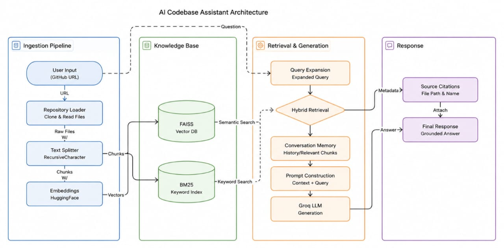

# AI-Codebase-Assistant

AI-Codebase-Assistant is an advanced Retrieval-Augmented Generation (RAG) based GitHub repository intelligence system designed to help developers understand large codebases, retrieve repository-specific information, explain workflows, and answer technical questions using conversational AI.

The system combines semantic retrieval, keyword retrieval, conversational memory, and grounded response generation to provide accurate and repository-aware answers with source citations.

---

# Key Features

- Multi-Repository Support
- Hybrid Retrieval (FAISS + BM25)
- Conversational Context Memory
- Query Expansion & Query Understanding
- Repository Workflow Explanation
- Grounded Prompting & Hallucination Reduction
- Source Citations with File Metadata
- Persistent Vector Storage
- Local Cached Vectorstores
- HuggingFace Embeddings
- Groq LLM Integration
- Repository-Aware Response Generation

---
# System Architecture



# System Workflow

The application follows a complete Retrieval-Augmented Generation (RAG) pipeline for repository understanding and conversational code intelligence.

## Workflow Steps

1. User provides a GitHub repository URL through the Streamlit interface.
2. Repository Loader clones and scans the repository recursively.
3. Source code and documentation files are extracted.
4. Metadata enrichment attaches:
   - repository name
   - file name
   - file path
5. RecursiveCharacterTextSplitter performs intelligent chunking.
6. HuggingFace sentence-transformers generate embeddings.
7. Embeddings are stored in FAISS Vector Database.
8. BM25 creates a keyword retrieval index.
9. User submits repository-related queries.
10. Query Expansion improves technical and workflow understanding.
11. Hybrid Retrieval combines:
    - Semantic Retrieval (FAISS)
    - Keyword Retrieval (BM25)
12. Retrieval results are merged and deduplicated.
13. Conversational memory provides chat context awareness.
14. Prompt construction combines:
    - retrieved chunks
    - conversational context
    - repository metadata
    - user query
15. Grounded prompting reduces hallucinations.
16. Groq LLM generates repository-aware grounded responses.
17. Source citations are attached to the final response.

---

# Architecture Components

## Ingestion Pipeline
- GitHub Repository Loader
- File Extraction
- Metadata Enrichment
- RecursiveCharacterTextSplitter
- HuggingFace Embeddings

## Vector & Retrieval Layer
- FAISS Vector Database
- BM25 Keyword Retrieval
- Local Cached Vectorstores

## Retrieval & Generation Layer
- Query Expansion
- Hybrid Retrieval
- Merge & Deduplication
- Conversational Context Memory
- Prompt Construction
- Grounded Prompting
- Groq LLM

## Response Layer
- Answer Generation
- Source Citations
- Final Grounded Response

---

# Tech Stack

| Component | Technology |
|---|---|
| Frontend | Streamlit |
| Framework | LangChain |
| LLM | Groq |
| Embeddings | HuggingFace Sentence Transformers |
| Vector Database | FAISS |
| Keyword Retrieval | BM25 |
| Programming Language | Python |

---

# Installation

## Clone Repository

```bash
git clone https://github.com/Pavani-D410/AI-Codebase-Assistant.git
cd AI-Codebase-Assistant
```

---

## Create Virtual Environment

### Windows

```bash
python -m venv venv
venv\Scripts\activate
```

### Linux / Mac

```bash
python3 -m venv venv
source venv/bin/activate
```

---

## Install Dependencies

```bash
pip install -r requirements.txt
```

---

# Environment Variables

Create a `.env` file in the project root directory.

```env
GROQ_API_KEY=your_api_key
```

---

# Run Application

```bash
streamlit run app.py
```
---

# Project Structure

```text
AI-Codebase-Assistant/
│
├── app.py
├── rag_pipeline.py
├── github_loader.py
├── requirements.txt
├── .env
├── vectorstores/
├── repos/
└── assets/
```
---

# Challenges Faced

- Semantic retrieval struggled with exact technical keywords
- Repository workflow understanding required multi-file reasoning
- Large repositories increased retrieval complexity
- Repeated embedding generation affected performance
- Hallucination reduction required grounded prompting
- Hybrid retrieval balancing required optimization

---

# Future Improvements

- Pinecone / ChromaDB Integration
- Re-Ranking Models
- Semantic Chunking
- Graph RAG
- Agentic Retrieval
- Local Evaluation Models
- Private Repository Authentication
- Advanced Dependency Graph Analysis

---

# Author

**Pavani Dangudubiyyam**
